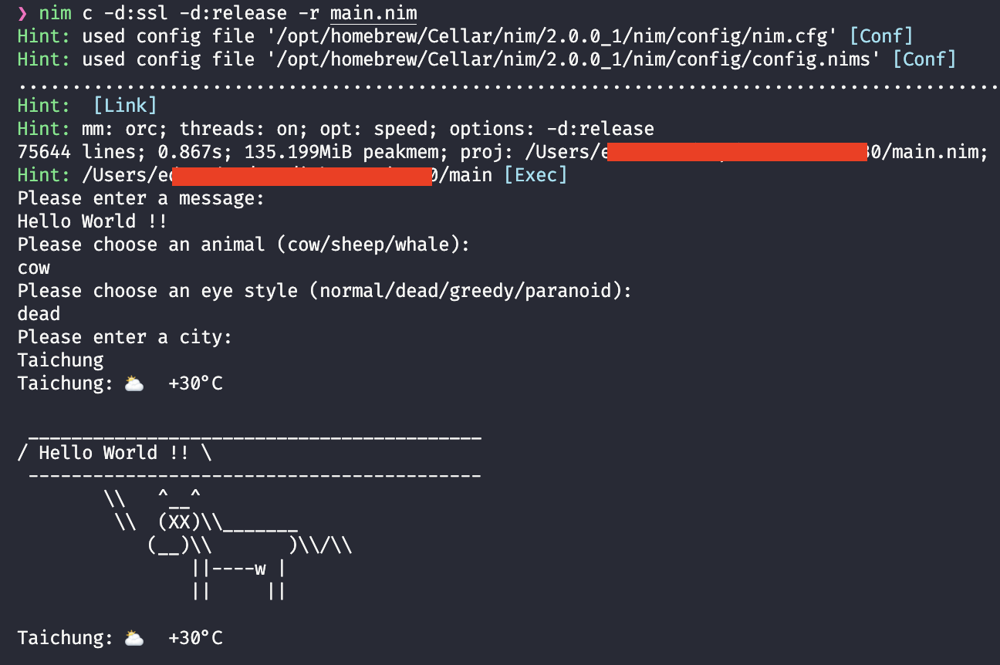

# nim-say
A nim version of Cowsay that generates ASCII art pictures + Weather

## Develop

Nim version: `>= 2.0`

```
nim c -d:release -d:ssl --opt:speed -r ./main.nim
```

## Build

```bash
# Install cross-compiler
nimble install https://github.com/iffy/nimxc.git

nimxc c --out:cowsay.linux_amd64 --outdir:releases -d:ssl -d:release --opt:speed --target linux-amd64 main.nim
nimxc c --out:cowsay.mac_arm64 --outdir:releases -d:ssl -d:release --opt:speed --target macosx-arm64 main.nim
```

## Screenshot



## License

Apache 2.0
